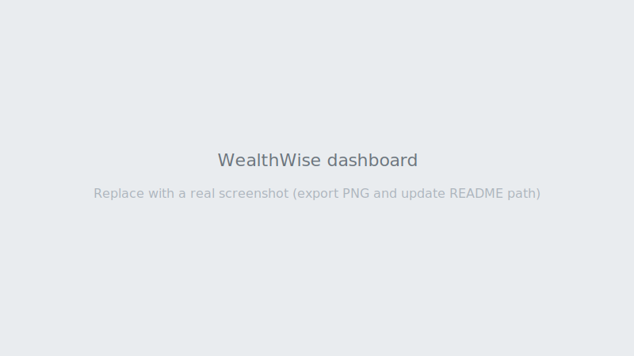

# WealthWise

Personal finance app: **Angular 17** + **Spring Boot 3** + **PostgreSQL** + **MongoDB**. Track spending, budgets, and rule-based alerts (with nightly analysis). Auth is **JWT**; the UI talks to a REST API on port **8080**.



_Replace with a real PNG/JPG export when you have one; update the image path in this README if needed._

---

## Architecture

```
┌─────────────┐     HTTP (JWT)      ┌─────────────────┐
│   Browser   │ ◄────────────────► │  Spring Boot    │
│  Angular    │   localhost:4200    │  REST + Security│
│  (nginx)    │      API :8080     │  + Scheduler    │
└─────────────┘                     └────────┬────────┘
                                            │
                    ┌───────────────────────┼───────────────────────┐
                    ▼                       ▼                       ▼
             ┌──────────┐            ┌──────────┐           ┌──────────┐
             │PostgreSQL│            │ MongoDB  │           │ Flyway   │
             │ users,   │            │ alerts,  │           │ migrations
             │ tx,      │            │ insights │           │ (SQL)    │
             │ budgets  │            │          │           └──────────┘
             └──────────┘            └──────────┘
```

- **PostgreSQL**: relational data (users, transactions, budgets).  
- **MongoDB**: `alert_logs`, `spending_insights`.  
- **Nightly job** (2:00 AM cron): alert engine + spending snapshots per user.

---

## Prerequisites

| Tool | Version (recommended) |
|------|------------------------|
| **Java** | 17 (JDK) |
| **Node.js** | 18 LTS or 20 LTS |
| **Docker** + **Docker Compose** | Current Desktop / CLI |
| **Maven** | Optional if you use `./mvnw` in `backend/` |

---

## Quick start (local dev)

1. **Databases**

   ```bash
   docker compose up -d postgres mongodb
   ```

2. **Backend** (from repo root)

   ```bash
   cd backend
   ./mvnw spring-boot:run
   ```

   API: [http://localhost:8080](http://localhost:8080)

3. **Frontend**

   ```bash
   cd frontend
   npm install
   npm start
   ```

   App: [http://localhost:4200](http://localhost:4200)

4. Register a user in the UI (or use the Postman **Register** request), then sign in.

---

## Full stack with Docker

Build and run API + UI + databases:

```bash
docker compose up --build -d
```

| Service   | URL |
|-----------|-----|
| Frontend  | [http://localhost:4200](http://localhost:4200) |
| Backend   | [http://localhost:8080](http://localhost:8080) |
| Postgres  | `localhost:5432` |
| MongoDB   | `localhost:27017` |

The backend container sets `SPRING_DATASOURCE_*` and `SPRING_DATA_MONGODB_URI` for the compose network. See `docker-compose.yml` and `backend/Dockerfile` for details.

---

## API documentation (Postman)

Import the collection and local environment:

- [postman/WealthWise.postman_collection.json](postman/WealthWise.postman_collection.json)  
- [postman/WealthWise.postman_environment.json](postman/WealthWise.postman_environment.json)

Select environment **WealthWise Local**, run **Login**; the Tests script stores the `token` for Bearer auth on protected requests.

---

## Tests

**Backend** (from `backend/`):

```bash
./mvnw test
```

**Frontend** (from `frontend/`):

```bash
npm test                 # interactive Karma
npm run test:ci          # headless, single run (ChromeHeadlessCI)
```

---

## Project layout (high level)

```
wealthwise/
├── backend/                 # Spring Boot API, Flyway, Dockerfile
├── frontend/                # Angular SPA, Karma, Dockerfile, nginx.conf
├── postman/                 # Collection + environment
├── docs/
│   └── BUILD_BLUEPRINT.md   # Original phased Cursor build instructions
├── docker-compose.yml
└── README.md
```

---

## Configuration notes

- **JWT secret**: set via `app.jwt.secret` in `backend/src/main/resources/application.yml` for local dev. Use env-specific secrets in production.  
- **CORS**: configured for `http://localhost:4200` in `SecurityConfig`.  
- **Angular API base**: `frontend/src/app/core/api-url.ts` (`http://localhost:8080`). Change for deployed environments.

---

## License

Private / personal project unless you add a license file.
